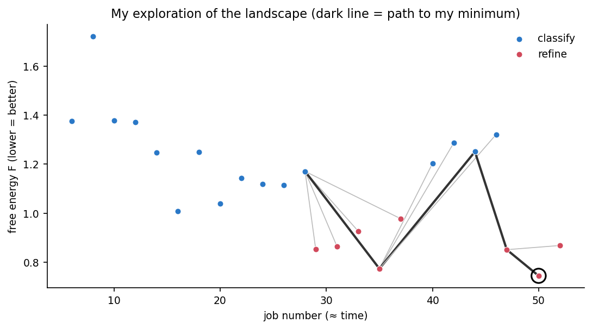
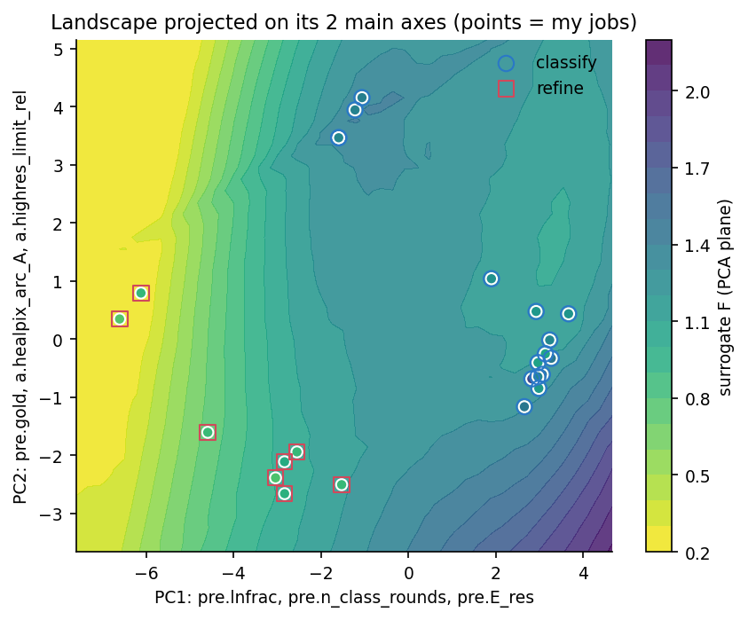
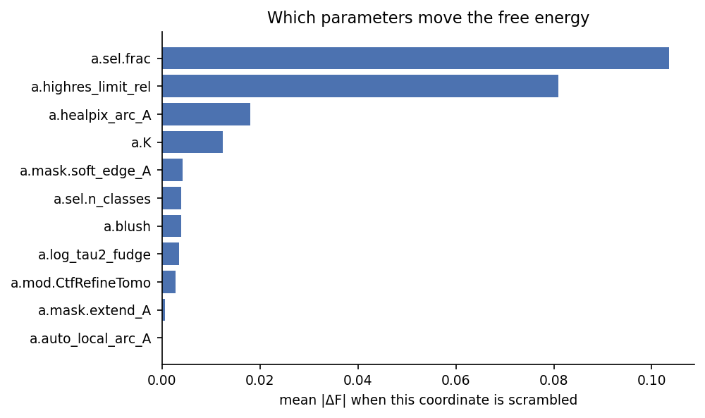
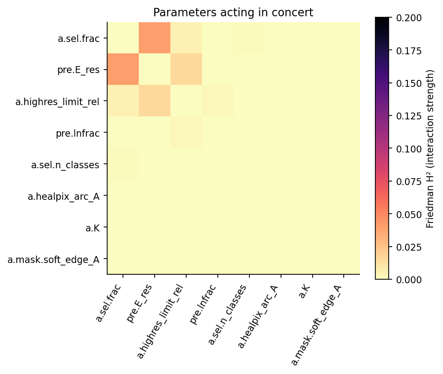
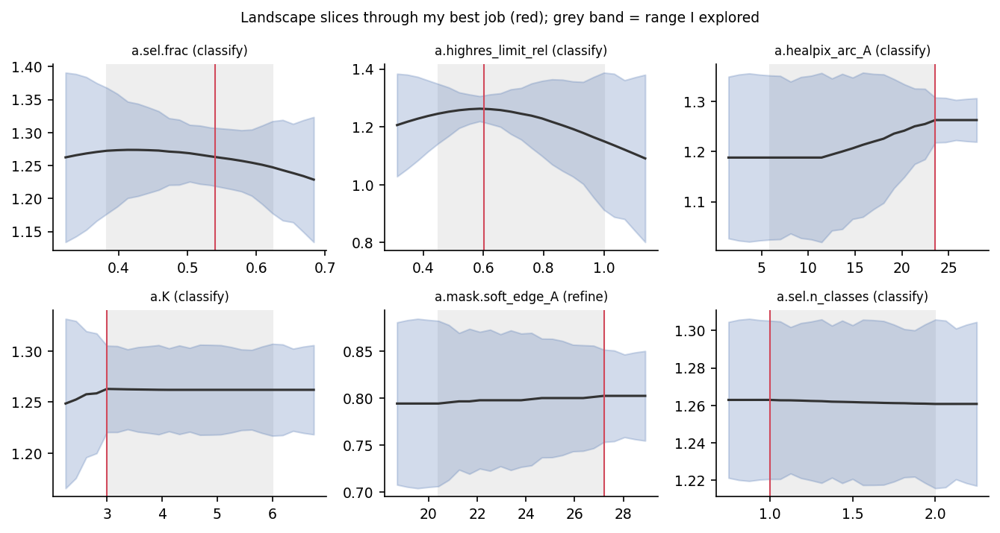
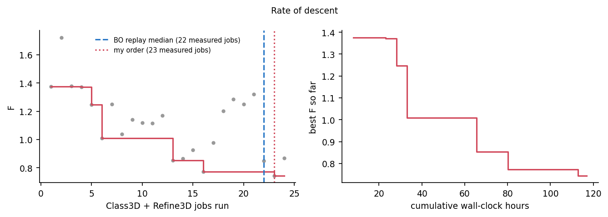

# sta-landscape


**Treat iterative RELION subtomogram averaging as descent on a learned free-energy landscape.**

When working on a small, hard-to-resolve target, I have to branch through many Class3D → Select → Refine3D jobs iteratively, tuning regularisation, E-step limits, sampling, masks, class selection and more. `sta_landscape` reads that whole branching history from my RELION project and does four things:

- It scores every state with a user-defined **free energy** that combines resolution, particle count and noise.
- It learns how each job type and parameter moves me across that landscape, with uncertainty, and which parameters act alone or together.
- It **plans job sequences and parameters for a modified particle** (extra subunit, dimer, larger box, different pixel size).
- It answers two questions about my own exploration:
  - **Rate:** how quickly (i.e., the number of steps) the minimum was reached - redundant steps will become visible.
  - **Depth:** whether a deeper minimum is likely, and which jobs would reach it.

It only reads files RELION already writes (`note.txt`, `*_model.star`, `*_data.star`, `postprocess.star`, …), so my workflow doesn't change.

> Figures below come from the built-in **synthetic** demo project, not from real data. See [`docs/example_report.html`](docs/example_report.html) for a full example report.

| Exploration of the landscape | The landscape on its two main axes |
|---|---|
|  |  |
| **Which parameters matter** | **Which act in concert** |
|  |  |




---

## The free energy

```
F = w_res · ln(d / d_Nyquist)  +  w_particles · E_particles  +  w_noise · noise  (+ w_compute · ln(1 + hours))
```

- `E_particles` depends on my preference: −ln(N/N₀) if more particles is better, +ln(N/N₀) if fewer is better, or (ln N/N_target)² if I have a target number.
- `noise` ∈ [0, 1] is a weighted mean of whichever of these exist for a job:
  - the SSNR noise fraction in a resolution band;
  - 1 − pmax;
  - half-map difference variance;
  - solvent/protein std ratio;
  - mask-induced correlation from the phase-randomised FSC;
  - personal 1–5 score (optional, from `annotations.csv`).

All weights are set in the config. See [docs/methods.md](docs/methods.md) for details.

## Install

```bash
git clone https://github.com/OWNER/sta-landscape.git
cd sta-landscape
pip install -e ".[maps]"        # or: pip install -r requirements.txt
```

Python ≥ 3.9. The `maps` extra installs `mrcfile`, which turns on the map-based noise metrics.

## Usage

```bash
sta-landscape demo --dir demo_run                     # synthetic project, full run, no data needed
sta-landscape init --dir my_analysis                  # writes config, target and annotation templates
# edit my_analysis/sta_config.yaml: project path(s), particle description, weights
sta-landscape scan     -c my_analysis/sta_config.yaml                       # check what was parsed
sta-landscape analyse  -c my_analysis/sta_config.yaml                       # landscape + rate + depth
sta-landscape transfer -c my_analysis/sta_config.yaml -t my_analysis/target.yaml   # + plan for the new particle
```

`python -m sta_landscape …` works too, without installing. Example inputs are in [`examples/`](examples/).

### Output (`output_dir/`)

| file | content |
|---|---|
| `report.html` | self-contained report with all figures and tables |
| `figures/*.png` | each figure as a PNG |
| `states.csv`, `transitions.csv`, `jobs.csv` | parsed project: every measured state with F terms and noise components |
| `model_skill.csv` | cross-validated accuracy of the learned model (read this first) |
| `sensitivity.csv`, `interactions.csv` | parameter importance and pairwise interaction strength (Friedman H²) |
| `timeline.csv`, `skippable_steps.csv`, `parameter_scans.csv` | rate: how efficiently  minimum was reached |
| `next_job_candidates.csv`, `summary.json` | depth: next jobs and multi-step plans, with P(improvement) and novelty |
| `recipe.csv` | path to the minimum in RELION terms |
| `transfer_plan.json`, `transfer_commands.txt` | plan for the modified particle, with `relion_refine` commands built from personal project |

## Brief Functionality

1. **Parse.** Every scientific `relion_refine` flag, mask parameter, class selection and intermediate job (CtfRefine, re-extraction…) becomes a coordinate. Particle-dependent flags are made dimensionless so they transfer between particles:
   - mask diameter relative to particle diameter;
   - angular step as arc length at the particle edge;
   - E-step limit relative to Nyquist;
   - offsets in Å.
2. **Learn.** A Gaussian-process and extra-trees ensemble predicts how each job changes resolution, particle fraction, noise and compute time. The uncertainty is propagated by Monte Carlo into F.
3. **Imitate and plan.** Candidate moves are drawn from past moves, weighted by a Boltzmann factor on how much each one lowered F. A beam search then finds job sequences that end in a Refine3D.
4. **Rate.** It replays jobs in the order they were run, the order Bayesian optimisation would have chosen, and a random order, respecting job dependencies. It also finds skippable steps and flat parameter scans.
5. **Depth.** It reports expected improvement, P(deeper minimum), multi-step plans from every fork on my path, the directions that were never varied, a Nyquist check and a Rosenthal–Henderson fit.
6. **Transfer.** It re-derives recipe for the new particle, predicts each step, and adds a physics estimate: 1/d_t² = 1/d_s² + (2/B)·ln(N_eff,t/N_eff,s), with N_eff = particles × symmetry × mass ratio.

Full description: [docs/methods.md](docs/methods.md).

## Caveats

- As may have been inferred, this might ending up just providing a summary instead of a prediction. Check `model_skill.csv`, and treat any proposal with novelty > 2 as an experiment.
- Class3D resolutions are not gold-standard. 
- Transfer from a single source particle relies on the dimensionless coordinates and the physics estimate and so adding projects for other particles lets the model learn how the optimum shifts with mass, size and symmetry.
- Formats from RELION 3.1 to 5.0 are handled, but the initial test runs were on synthetic projects only. Run `scan` and inspect `jobs.csv` on real projects first.

## Repository layout

```
sta_landscape/          the package
  starfile_io.py        STAR reader
  relion_project.py     project scan, job graph, metric extraction
  codec.py              flags <-> landscape coordinates (dimensionless transfer)
  landscape.py          noise index, free energy, states and transitions
  models.py             GP + extra-trees dynamics model with uncertainty
  analysis.py           sensitivity, interactions, planner, rate and depth analyses
  transfer.py           plan for a modified particle
  report.py             figures (PNG) + HTML report
  pipeline.py           end-to-end run
  demo.py               synthetic RELION project with a hidden landscape
  config.py             defaults and templates
examples/               example config, target and annotation files
docs/                   methods, example report, figures
scripts/                make_docs_figures.py (regenerates docs/images from the demo)
tests/                  pytest suite (unit tests + full pipeline on the synthetic project)
.github/workflows/      CI
```

## Development

```bash
pip install -e ".[dev,maps]"
pytest -q                               # ~1 min, includes a full synthetic run
python scripts/make_docs_figures.py     # refresh docs/images and docs/example_report.html
```
